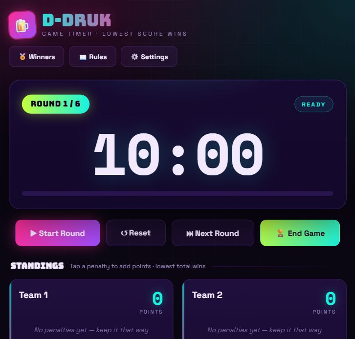

# D-Druk Game Timer

D-Druk Game Timer is a local party-game scoreboard and round timer for D-Druk. It runs in the browser, but it is served by a small Node.js server so winners can be saved to a file and shown again the next time the app opens.



## Features

- Round timer with start, pause, reset, and next-round controls.
- Big final countdown when a round is about to end.
- Team setup with names and participants.
- Live penalty buttons for lost cups, lost mini-games, late arrivals, and rule breaks.
- Automatic standings where the lowest score wins.
- Game-over podium and full final scoreboard.
- Persistent winner list saved by the server in `winners.json`.
- Built-in rules modal for quick reference during the game.

## Screenshots

### Main Game View


### Game Over View


## Quick Start

### Windows

Double-click:

```bat
start-game-server.bat
```

Then open:

```text
http://localhost:3000
```

### Node.js

If Node.js is installed, you can also run:

```bash
npm start
```

Then open:

```text
http://localhost:3000
```

## How Winner Logging Works

When a game ends, the app builds a final result from the current standings. Pressing **Save winner to the list** sends that result to the local server:

```text
POST /api/winners
```

The server adds the newest result to the top of `winners.json`. When the Winners modal opens, the app reads:

```text
GET /api/winners
```

That means the winner list survives browser refreshes, browser restarts, and reopening the app later.

Example winner entry:

```json
{
  "winner": "Team 1",
  "members": "Anna, Mads, Sofie",
  "score": 3,
  "rounds": 6,
  "teams": 6,
  "standings": [
    {
      "name": "Team 1",
      "members": "Anna, Mads, Sofie",
      "score": 3
    }
  ],
  "date": "2026-06-17T19:40:02.762Z"
}
```

## API

| Method | Endpoint | What it does |
| --- | --- | --- |
| `GET` | `/api/winners` | Returns all saved winner entries, newest first. |
| `POST` | `/api/winners` | Saves a new winner entry. |
| `DELETE` | `/api/winners` | Clears the local winner list. |

## Files

| File | Purpose |
| --- | --- |
| `index.html` | The complete browser app and game UI. |
| `server.js` | The local Node.js server and winner-log API. |
| `package.json` | Project metadata and the `npm start` command. |
| `start-game-server.bat` | Easy Windows launcher for the server. |
| `winners.json` | Local winner history created and updated by the server. |

## Privacy Note

`winners.json` is ignored by Git. Your real game history stays on the computer running the server and is not uploaded to GitHub.

## Development

Start the server:

```bash
npm start
```

Edit `index.html` for the app UI or `server.js` for the API. Refresh `http://localhost:3000` after changes.
