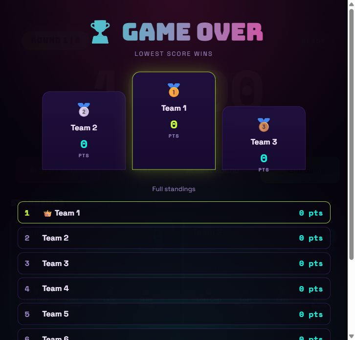

# D-Druk Game Timer

D-Druk Game Timer is a party-game scoreboard and round timer for D-Druk. It can run locally with a small Node.js server, or on Cloudflare Pages with Cloudflare D1 storing the winners list.


## Features

- Round timer with start, pause, reset, and next-round controls.
- Big final countdown when a round is about to end.
- Team setup with names and participants.
- Live penalty buttons for lost cups, lost mini-games, late arrivals, and rule breaks.
- Automatic standings where the lowest score wins.
- Game-over podium and full final scoreboard.
- Dedicated Winner Hall page with a champion spotlight and saved history.
- Optional team photo upload when saving a winner.
- Admin-gated winner deletion: press Delete, enter the passcode, then choose exactly one saved winner to remove.
- Persistent winner list saved locally in `winners.json` or online in Cloudflare D1.
- Built-in rules modal for quick reference during the game.

## Screenshots

### Main Game View


### Game Over View



## Quick Start

### Windows

Double-click:

```bat
start-game-server.bat
```

Then open:

```text
http://localhost:3000
```

### Node.js

If Node.js is installed, you can also run:

```bash
npm start
```

Then open:

```text
http://localhost:3000
```

## Cloudflare Hosting

This repo is ready for Cloudflare Pages:

1. Create a D1 database named `ddruk-winners`.
2. Replace `replace-with-cloudflare-d1-database-id` in `wrangler.jsonc` with the database ID from Cloudflare.
3. Apply the database migration:

```bash
npx wrangler d1 migrations apply ddruk-winners --remote
```

4. Deploy the Pages site:

```bash
npm run deploy
```

5. Set the admin passcode secret used for deleting winners:

```bash
npx wrangler pages secret put ADMIN_PASSCODE --project-name ddruk
```

6. In Cloudflare Pages, add your custom domain or subdomain.
7. Optional: In Cloudflare Zero Trust, create an Access application for that hostname if you want a login gate.

For local Cloudflare-style testing, run:

```bash
npm install
npm run dev:cloudflare
```

## How Winner Logging Works

When a game ends, the app builds a final result from the current standings. Pressing **Save winner to the list** sends that result to the local server:

```text
POST /api/winners
```

The API stores the newest result first. Locally, the Node server writes `winners.json`. On Cloudflare, the Pages Function writes to D1. When the Winners modal opens, the app reads:

```text
GET /api/winners
```

That means the winner list survives browser refreshes, browser restarts, and reopening the app later.

Example winner entry:

```json
{
  "winner": "Team 1",
  "members": "Anna, Mads, Sofie",
  "score": 3,
  "rounds": 6,
  "teams": 6,
  "standings": [
    {
      "name": "Team 1",
      "members": "Anna, Mads, Sofie",
      "score": 3
    }
  ],
  "photo": "data:image/jpeg;base64,...",
  "date": "2026-06-17T19:40:02.762Z"
}
```

## API

| Method | Endpoint | What it does |
| --- | --- | --- |
| `GET` | `/api/winners` | Returns all saved winner entries, newest first. |
| `POST` | `/api/winners` | Saves a new winner entry. |
| `DELETE` | `/api/winners?id=<id>` | Deletes one saved winner. Requires the admin passcode. |

## Files

| File | Purpose |
| --- | --- |
| `public/index.html` | The complete browser app and game UI. |
| `server.cjs` | The local Node.js server and winner-log API. |
| `functions/api/winners.js` | Cloudflare Pages Function for the online winner-log API. |
| `migrations/0001_create_winners.sql` | Cloudflare D1 schema for saved winners. |
| `migrations/0002_add_winner_photo.sql` | Adds optional winner team photos to saved entries. |
| `wrangler.jsonc` | Cloudflare Pages and D1 configuration. |
| `package.json` | Project metadata and the `npm start` command. |
| `start-game-server.bat` | Easy Windows launcher for the server. |
| `winners.json` | Local winner history created and updated by the server. |

## Privacy Note

`winners.json` is ignored by Git. Your real game history stays on the computer running the server and is not uploaded to GitHub.

## Development

Start the server:

```bash
npm start
```

Edit `public/index.html` for the app UI or `server.cjs` for the local API. Refresh `http://localhost:3000` after changes.

The local Node server uses `ADMIN_PASSCODE` for Winner Hall delete actions. If it is not set, local development uses:

```text
ddruk-admin
```
